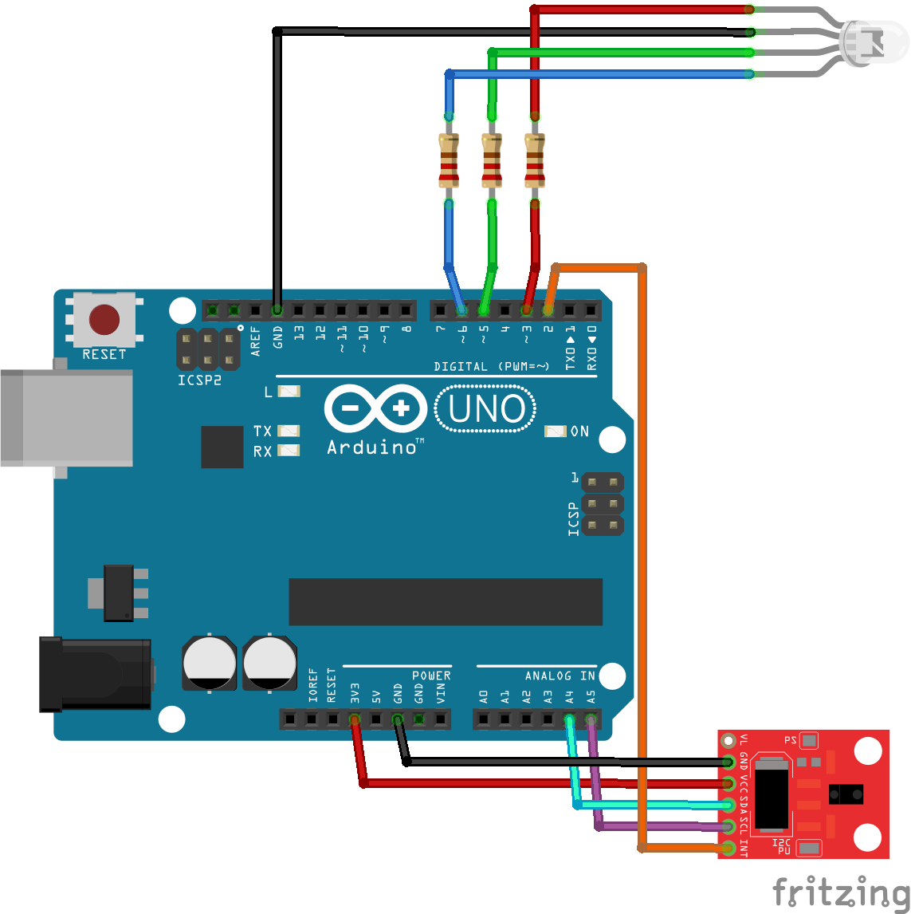

# Arduino Workshop

The aim of this workshop is to control RGB diode using the ADPS-9960 gesture sensor

## Resources and Documentation

### Arduino IDE Installation

* Go to [https://www.arduino.cc/en/main/software](https://www.arduino.cc/en/main/software) and download Arduino IDE for your machine
* Install the IDE
* Open the IDE, go to Tools => Boards and select "Arduino/Genuino Uno"

### How to Install Library for APDS-9960

The GitHub repository: [https://github.com/sparkfun/SparkFun_APDS-9960_Sensor_Arduino_Library](https://github.com/sparkfun/SparkFun_APDS-9960_Sensor_Arduino_Library)

You can install the library via Arduino IDE:
* Open Arduino IDE
* Go to Arduino Library manager (Tools => Manage libraries...)
* Search for "Sparkfun APDS9960 Library" and install it
* Close the Library manager

## Circuit Scheme

Arduino is connected to the RGB diode and APDS sensor as follows:

Important information:

* Common anode diode is connected to the ground and to the digital pins 3 (red), 5 (green) and 6 (blue) that support PWM
* APDS sensor is connected to arduino through I2C interface - data on analog pin A4 and clock on analog pin A5
* ADPS sensor's interrupt pin is connected to Arduino's digital pin 2 that must be set to listen for that interrupt